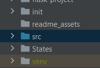
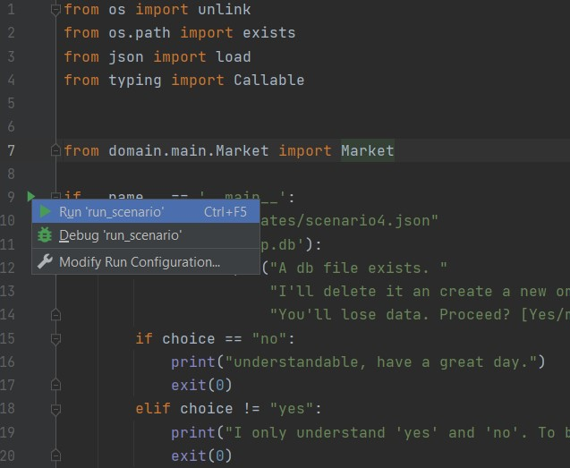

# :hammer_and_wrench: Workshop Project

## :arrow_up: Preparing

1. Ensure python, version >= 3.10

2. Open folder in terminal, run:

   ```
   python -m venv venv    # some installations of python3 are instead `python3` `python -3` or `py -3`
   ./venv/Scrtips/Activate
   pip install -r requirements.txt
   ```

3. Open in PyCharm

4. Ensure `src` in marked as sources folder (blue). If not, right click it > mark as > sources (blue)
   

5. Ensure PyCharm is configured to run with venv interpreter:

   1. Go to settings (in File menu)
   2. Go to Project > Project Interpreter
   3. In Python Interpreter, should be `<python-version> (Workshop-Project) <your venv directory path>/scripts/python`

## :seedling: (optional) seeding

1. Open `src/run_scenario.py` in PyCharm

2. If needed, change `file_path` variable. 

3. Run file via the play button in the editor gutter:

   

   ## :arrow_forward: run app

   1. Go to `src/webapp.py` in PyCharm

   2. Run via play button in editor gutter:

      

